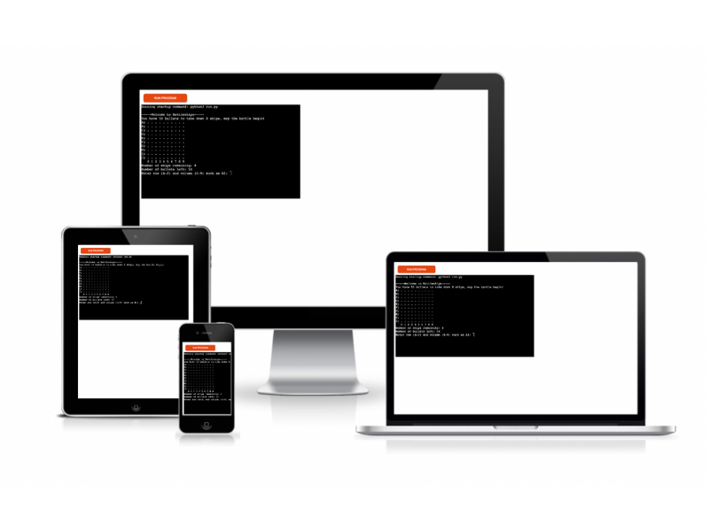
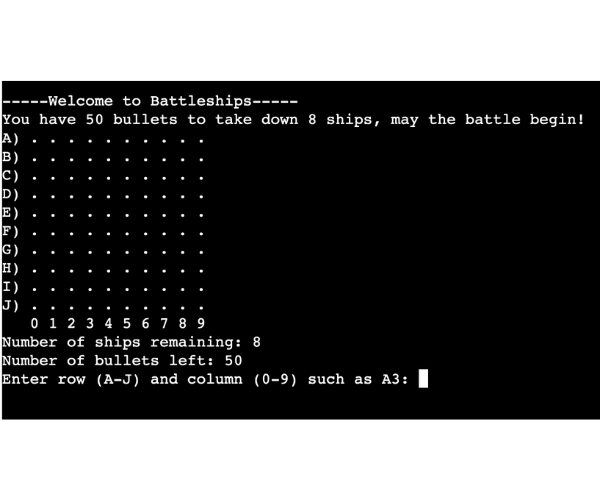
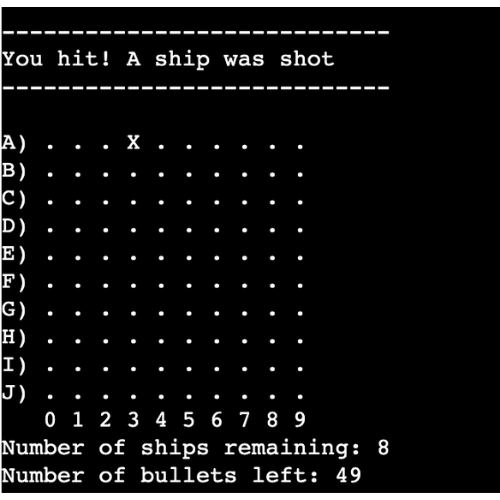
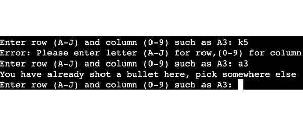

# **Battleships**
Battleships is a Python terminal based game, which runs in the Code Institute mock terminal on Heroku.

The user can try to beat the game by locating all the ships on the board before they run out of cannonballs.
Each ship occupies one square on the board.

[To battle!](https://my-battleships-game1.herokuapp.com/ "BATTLESHIPS")

## How to play
---
Battleship (also known as Battleships or Sea Battle) is a strategy type guessing game for two players. It is played on ruled grids (paper or board) on which each player's fleet of warships are marked. The locations of the fleets are concealed from the other player. Players alternate turns calling "shots" at the other player's ships, and the objective of the game is to destroy the opposing player's fleet.

Battleship is known worldwide as a pencil and paper game which dates from World War I. It was published by various companies as a pad-and-pencil game in the 1930s and was released as a plastic board game by Milton Bradley in 1967. The game has spawned electronic versions, video games, smart device apps and a film. Read more on [Wikipedia](https://en.wikipedia.org/wiki/Battleship_(game)) if you would like to learn more.

In my version of the game, the player has only one enemy - chance. The player starts the game with 50 cannonballs and 8 ships hidden around the board. From then on, guided by faith and good aim, the user would have to find all the ships before they ran out of ammmo. If they succeed the game is won, else they will lose.

## Features
---
### Existing features
- Random board generation
    - Ships are randomly placed on the game board
    - The player can not see any of the ships placed

- Accepts user input
- maintains scores

- Input validation and error-checking
    - You cannot enter coordinates outside of the grid
    - You cannot enter the same guess twice

## Testing
---
- I have manually tested this project by doing the following:
    - Ran the code through the PEP8 linter and was returned no errors
    - Given invalid inputs such as strings, out of bounds inputs, same input twice
    - Tested in my local terminal and the Code Institute Heroku terminal

### Bugs
#### Solved Bugs

- When running my code through the PEP8 linter there were multiple errors returned for trailing whitespace or exceeding the line length. Fixed the errors by tracing down the whitespace and deleting it. The '_line too long_' error I fixed by rewriting the comments within the length limit.
- In the beginning of my code, the block comment was indicated by using the  ` """ ` symbol and it returned an error '_String statement has no effect_" which I fixed by reforming the block comment into a sequence of single line comments using the `#` symbol.

## Remaining Bugs

- No bugs remaining

## Validator Testing

- PEP8
    - No errors were returned from PEP8online.com

## Deployment
---

This project was deployed using Code Institute's mock terminal for Heroku.
- Deployment sequence

    - Create a new Heroku application
    - Set the buildbacks to `Python` and `NodeJS` in that order
    - Link the Heroku app to the repository
    - Click on **Deploy**

## Credits
---
- Code Institute for the deployment terminal
- Wikipedia for the details on the game Battleship
- Project created with the help of [CodeReview](https://codereview.stackexchange.com/questions/232013/a-simple-battleship-game)
